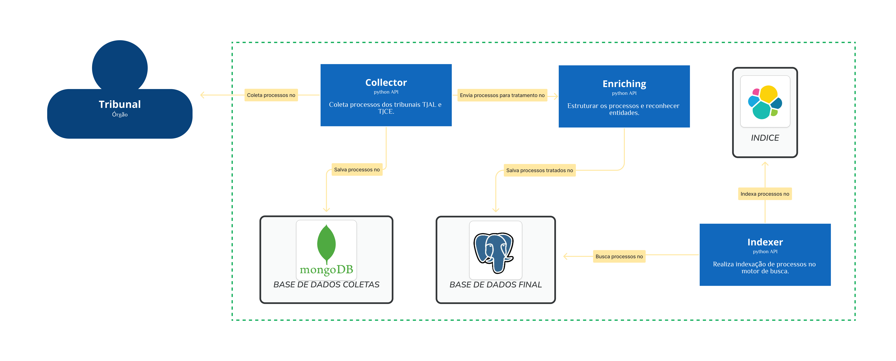
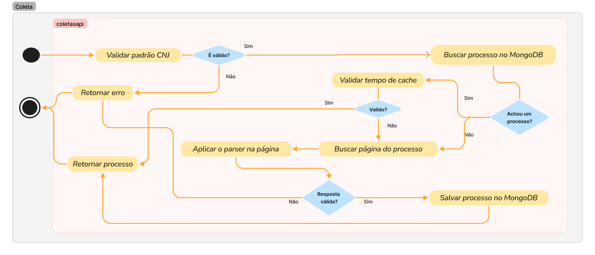
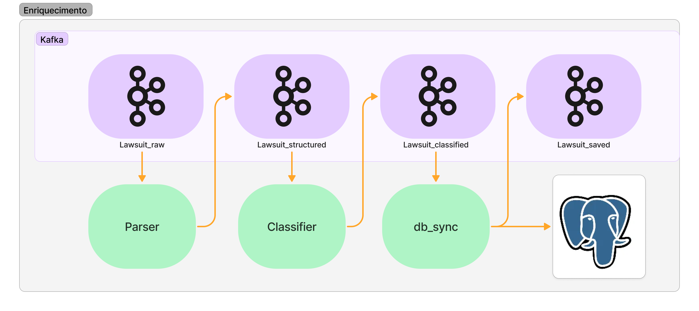
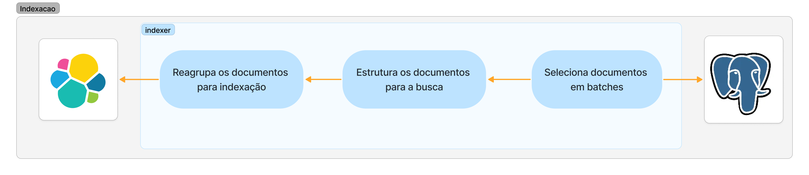

# FLuxo de Processos

Diagramas para o entendimento do fluxo de processos.

## Estrutura do Fluxo

## Coleta de processos

## Enriquecimento de processos

- **Parser**: Estrutura os processos, atribui id aos envolvidos, padroniza nomes e datas.
- **Classifier**: Identifica temas sensíveis dentro do processo. (Menor infrator, violência doméstica e crime de ódio)
- **db_sync**: Salva os processos em uma base de conhecimento geral. (postgres) 

## Indexação de processos

