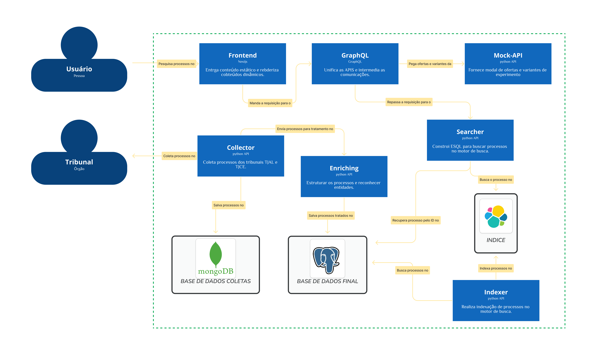

# Projeto Mini-Buscador

Para entender melhor o projeto leia os READMES indicados abaixo:
- Leia o README apenas do **frontend** [aqui.](./FRONTEND.md)
- Leia o README apenas do **coletas de dados** [aqui.](./coletas-api/README.md)
- Leia o README apenas do **enriquecimento de dados com kafka** [aqui.](./kb-kafka-pipeline/README.md)
- Leia o README apenas do **projeto de search** [aqui.](./search/README.md)

## Estrutura


Para entender melhor os fluxos, leia:
- Fluxo dos **processos**: [LAWSUIT_FLOW.md.](./LAWSUIT_FLOW.md)
- Fluxo dos **usuários**: [USER_FLOW.md.](./USER_FLOW.md)

**Observação**: certifique-se de que as aplicações estão ativas.

## Configuração do ambiente
Os serviços de todos os projetos estão em um único docker-compose (mesma docker-net). Execute:

### Infraestrutura
```bash
docker-compose build
```

Para subir a infraestrutura, execute na raiz do projeto:

```bash
make run-app
```

### backend-graphql
Para subir o graphql, execute:

```bash
make run-graphql
```

### frontend
Para subir o frontend, execute:

```bash
make run-frontend
```

Você poderá visualizar a página em:

```bash
http://localhost:3000
```

### Indexação

Verififque se há dados salvos no banco de dados antes de iniciar a indexação. Para isso execute o comando a seguir, ele irá disparar um script em python para fazer 8 requisições à API de coletas. O fluxo do pipeline deve seguir e assim os dados serão inseridos no postgres.

```bash
make run-send-requests-to-coletasapi 
```

Para realizar o pipeline de indexação do elasticsearch, execute:

```bash
make run-indexer-pipeline
```

13 documentos deverão ser indexados no elasticsearch.

### Testes

Para rodar os testes unitários dos projetos, execute:

```bash
make run-unit-tests
```

Para rodar os testes de integração dos projetos, execute:

```bash
make run-integration-tests
```
Não esqueça se subir o searcher.

### Encerrar

```bash
make stop-all
```

## Como executar

- Exemplo de requisição para o endpoint de coletas `localhoat:8000`:
```bash
curl -X GET "http://localhost:8000/lawsuit?lawsuit_number=0709782-13.2022.8.02.0058&max_cache_age_seconds=600000"
```

- Exemplo de requisição para o endpoint de busca `localhoat:3003`:
```bash
curl -X POST "http://localhost:3003/search" -H "Content-Type: application/json" -d '{
        "query": "\"José Cícero Alves da Silva\"",
        "filters":{
            "date": {
                "date": "2023-01-01",
                "operator": "<"
            }
        },
        "limit": 1,
        "offset": 0
    }'
```

- Exemplo de consultas para o buscador:
```bash
0729685-21.2016.8.02.0001
```
```bash
0710802-55.2018.8.02.0001
```

## Melhorias
- Automatizar os pipelines com dags.
- Utilizar kubernetes para orquestrar os serviços.
- Criar um crawler para diários oficiais
- Automatizar todos os testes

## Dificuldades da integração
- Diferença de formato de dados entre os desafios

## Dependencies

- [Make](https://www.gnu.org/software/make/)
- [Python 3.11](https://www.python.org/)
- [Poetry 1.8.2](https://python-poetry.org/)
