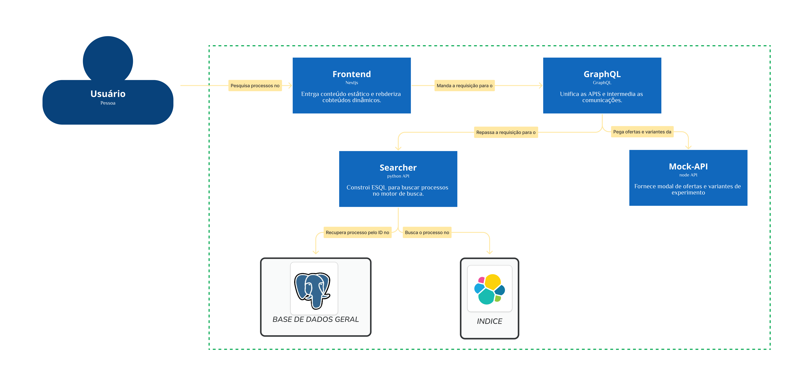
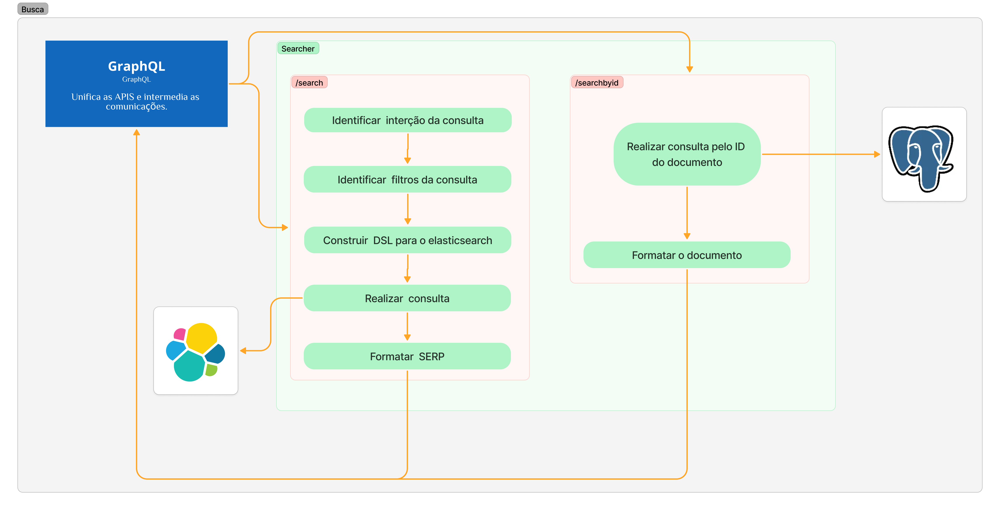
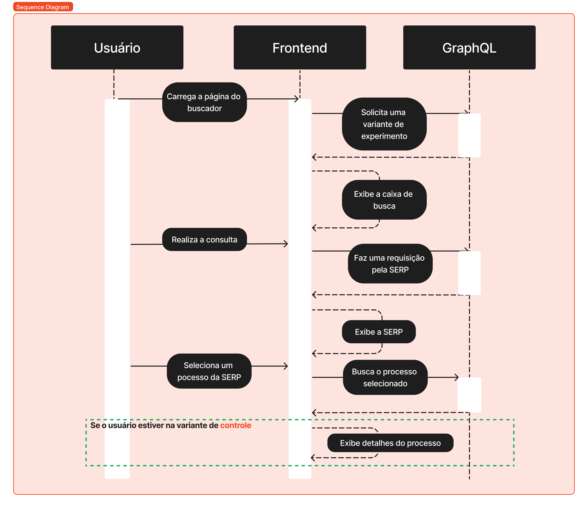
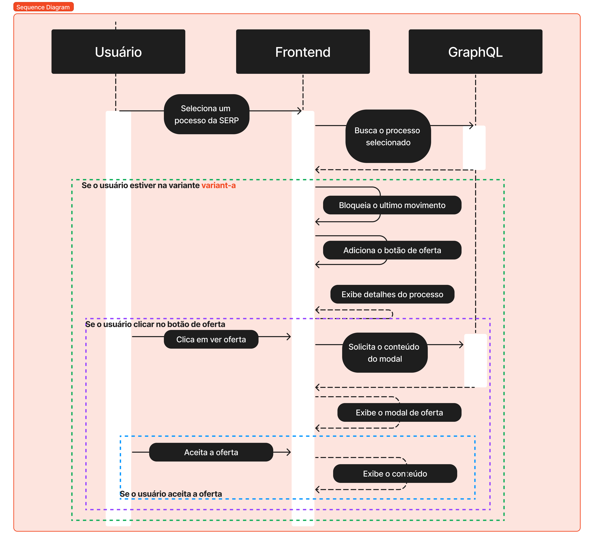
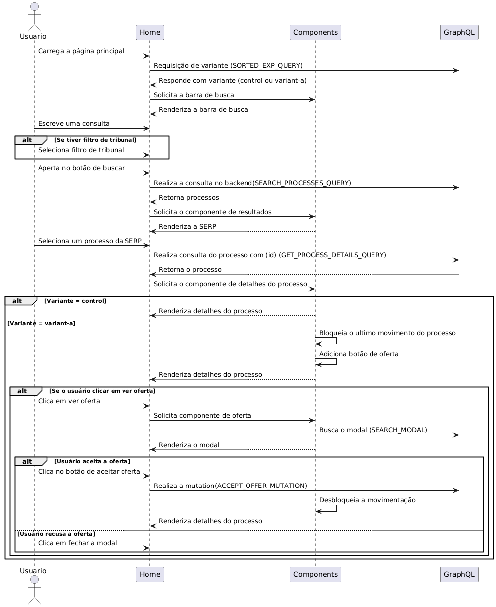

# Fluxos do Usuário

## Estrutura Geral

## Realização da Busca

## Frontend e Fluxos de Experimento

### Diagrama de Sequência Resumido

#### Fluxo Principal

#### Fluxo alternativo

### Diagrama de Sequência Completo

