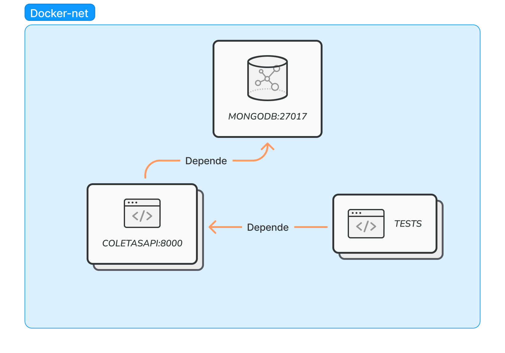
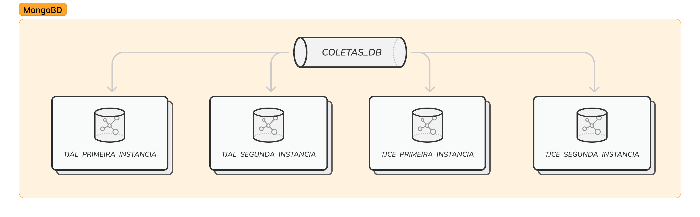
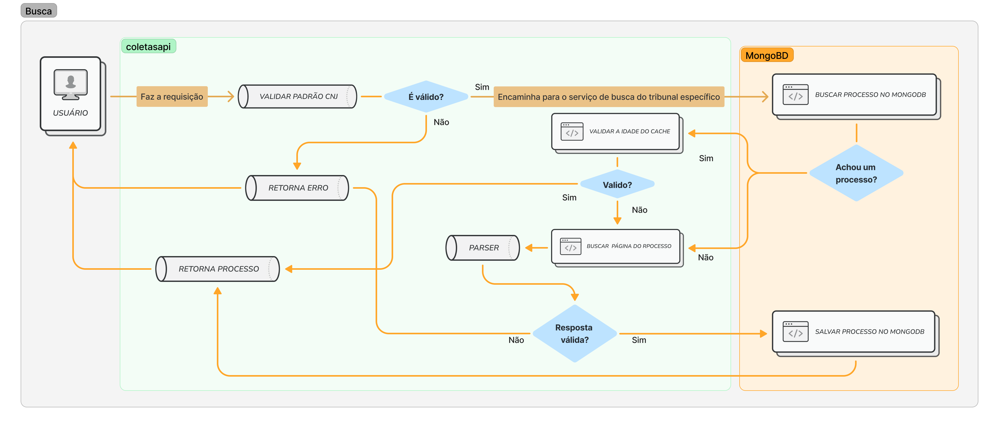

# Projeto Coletas
O objetivo deste projeto é desenvolver uma API que realiza busca de processos nos tribunais **TJAL** e **TJCE**.

## Estrutura do Projeto

### Docker Network


### Banco de Dados


### Fluxograma de Busca



## Configurando o Ambiente

Para subir os serviços da API, execute na pasta raiz:

```bash
sudo docker-compose build
```

```bash
sudo docker-compose up
```

Se preferir executar em segundo plano, sem acompanhar os logs:

```bash
sudo docker-compose up -d
```

## Rotas Disponíveis

### Rota `/lawsuit`
Rota principal da API para realizar buscas de processos. Parâmetros:

- `lawsuit_number`: Número do processo.
- `max_cache_age_seconds`: Tempo máximo (em segundos) que o processo deve ter sido coletado antes de ser considerado desatualizado.

### Rota `/`
Rota de Hello World! para verificar o funcionamento da API. <3

## Testes

### Scripts de Teste
Você pode testar o crawler localmente caso já tenha as dependencias instaladas.

```bash
cd coletasAPI
```

```bash
pytest tests/crawler.py
```

### Testando com Curl
Também é possível fazer as requisições via **curl** como no exemplo:

```bash
curl -X GET "http://localhost:8000/lawsuit?lawsuit_number=0710802-55.2018.8.02.0001&max_cache_age_seconds=600000"
```

### Ambiente de testes
Para rodar os testes automatizados com pytest no ambiente criado, execute:

```bash
sudo docker-compose run tests
```

# Considerações

## Dificuldades

- Crawlers: Acredito que a minha maior dificuldade em relação à construção dos crawlers foi lidar com os detalhes de cada situação. Os tribunais envolvidos no projeto permitem uma coleta mais "simples", o que facilitou bastante o processo, mas ainda assim havia muitos desafios, como: processos inexistentes, processos em segredo de justiça e processos com informações incompletas.

- API: A construção da API foi relativamente tranquila. A parte que gerou um pouco mais de dificuldade foi a estruturação dos serviços e a configuração dos diferentes ambientes.

- Banco de dados: Eu nunca havia trabalhado com MongoDB, então foi algo bem novo. O fato de ele se assemelhar ao Elasticsearch me ajudou a compreender melhor seu funcionamento. Como não tinha muita experiência, tentei fazer tudo da forma mais simples possível. No início, tive algumas dificuldades para diferenciar uma coleção de um índice (relacionava com o índice do Elasticsearch e achava que eram a mesma coisa), mas após ler a documentação, essa diferença ficou mais clara.

- Testes: De todas as partes, essa foi a experiência mais nova para mim. Apesar de nunca ter usado o MongoDB antes, já havia testado outros bancos de dados. No entanto, nunca tinha trabalhado com ambientes de testes. Demorei um pouco para entender qual seria a melhor abordagem para encaixar os testes no meu projeto. Para estudar sobre isso, usei a documentação do pytest-mock, unittest e também consultei IA's generativas para obter dicas.

- Comentários: Estou acostumada a fazer códigos apenas para mim mesma, mas fiquei receosa de que alguém pudesse não entender o que eu quis fazer. Por isso, comentei bastante, principalmente na parte do parser do crawler, que contém muitos detalhes específicos.

## Melhorias
- Tratamento de erros: O meu tratamento de erros é muito simples. Tentei personalizar, mas eles ainda ficaram genéricos. Gostaria de tratá-los de forma mais específica.

- Banco de dados: Pretendo melhorar as coleções, talvez criando coleções separadas para as partes e movimentos do processo.

- Testes: Quero aprimorar o ambiente de testes para conseguir testar qualquer tipo de cenário na minha aplicação (tanto síncrono quanto assíncrono).
