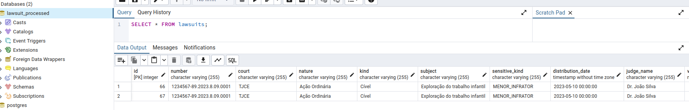

# Pipeline de enriquecimento de dados

Este README tem como objetivo fornecer informações sobre a minha implementação do pipeline de enriquecimento de dados utilizando Kafka.

## Pré-requisitos

* [Python 3.11](https://www.python.org/)
* [Poetry 1.8.2](https://python-poetry.org/)
* [Docker](https://www.docker.com/)
* [Docker Compose](https://docs.docker.com/compose/gettingstarted/)
* [Make](https://www.gnu.org/software/make/)

## Pipeline


## Configurando o ambiente
### Makefile
Para subir o `kafka`, `web-kafka`, `postgres` e `pgadmin`, execute na raiz do projeto:

```bash
make run-infra
```

Para subir as aplicações `parser`, `classifier` e `db_sync` do pipeline, execute na raiz do projeto:

```bash
make run-pipeline-apps
```

Para encerrar todos os serviços, execute:

```bash
make stop-all
```
### AKHQ
Visualize os dados do kafka através do kafka-web, o AKHQ. 

Acesse: ```http://0.0.0.0:8081```

### Postgres e pgadmin

- Acesse o `pgadmin` em: `http://localhost:16543`
- Faça login com as credenciais especificadas no `docker-compose`.
- Selecione a opção de criar novo servidor.
- Dê um nome ao seu servidor.
- Preencha o host de acordo com o nome especificado no `docker-compose`.
- Preencha as credenciais de acesso, nesse projeto vamos utilizar user e senha como `postgres`. 

**OBS**: Apenas para fins didáticos e para testes.


Após a criação do servidor, você deverá ser capaz de utilizar a Query Tool do banco lawsuit_processed para fazer consultas.


### Avisos
Ao fazer modificações nos códigos de um container você deverá construir a imagem do container e subi-lo de novo.

Exemplo: 
```bash 
docker-compose build nome-servico-modificado
```

```bash 
docker-compose up -d nome-servico-modificado
```
## Testando os serviços

**Observação**: Os testes unitários e testes de integração estão inseridos no Github Actions Workflow e são executados a cada `push`.

### Como enviar dados para o tópico lawsuit_raw
É possível enviar uma mensagem para o tópico lawsuit_raw por intermédio do seguinte comando:
```bash
make produce-example-message
```
Também é possível mudar o valor da mensagem a ser enviada mudando o valor de `lawsuit.json` em `kb-kafka-pipeline/initial_payload_producer`.

Ao executar o comando você deverá ser capaz de visualizar se ele foi bem sucedido ou não por intermédio do terminal.

Se a mensagem for enviada com sucesso e se as aplicações estiverem ativas você deverá ser capaz de acompanhar no AKHQ.


### Testes unitários
Criei testes unitários utilizando `pytest` para testar as funções de transformações de dados das minhas aplicações.

Você pode testar a qualquer momento todos os testes de uma só vez utilizando o comando:

```bash
make run-unit-tests
```

Se você quiser rodar separadamente, execute:
```bash
docker-compose run --rm --remove-orphans parser poetry run pytest tests/unit-tests/test_parser.py
```

```bash
docker-compose run --rm --remove-orphans classifier poetry run pytest tests/unit-tests/test_identifier.py
```

### Testes de integração
Criei testes de integração para verificar o envio de dados para os tópicos no Kafka. A ideia é produzir uma mensagem em um tópico e, em seguida, consumi-la para verificar se o dado que queríamos enviar foi efetivamente enviado.

Você pode testar a qualquer momento todos os testes de uma só vez utilizando o comando:

```bash
make run-integration-topics-tests
```

Se você quiser rodar separadamente, execute:
```bash
docker-compose run --rm --remove-orphans parser poetry run pytest tests/integration-tests/test_parser_integration.py
```

```bash
docker-compose run --rm --remove-orphans classifier poetry run pytest tests/integration-tests/test_classifier_integration.py
```

```bash
docker-compose run --rm --remove-orphans db_sync poetry run pytest tests/test_db_sync_integration.py
```

## Considerações

### Dificuldades
- **Kafka vs Airflow**: no inicio a primeira dificuldade que eu tive foi para diferenciar a finalidade do Kafka com a finalidade do Airflow. Eu consegui diferenciar as finalidades, mas ainda tenho dificuldade de entender como os dois funcionariam juntos.
- **Consumer Commit**: nas minhas primeiras versões eu tive difculdade para consumir as mensagens. Primeiro ele só consumia as mensagens que eram enviadas depois que o meu consumer estava ativo, depois ele consumia todas as mensagens todas as vezes. Passei a controlar os offsets pelo commit e então os dados ficaram consistentes.
- **Testes**: provavelmente foi a parte que eu mais quebrei cabeça. Tive erros em relação a importação de modulos no diretório do meu container. Consegui resolver forçando a mudança de diretório. Também tive esse erro no projeto de coletas, fiquei feliz que consegui resolver esse erro agora nesse projeto, era uma das melhorias que eu queria fazer no projeto passado.
### Melhorias
- Gostaria de encontrar uma maneira de evitar a duplicação de dados. 
    - Exemplo: ao consumir dois registros iguais em sequencia do lawsuit_raw não permitir a continuidade do segundo registro para o lawsuit_structured.
    - Possível solução: criar um id com hash dos dados.
- Evoluir o pipeline para kafka.operators do airflow.

### Fontes visitadas para referências futuras
- [Kafka Operator](https://www.astronomer.io/docs/learn/airflow-kafka)
- [aiokafka](https://pypi.org/project/aiokafka/)
- [psycopg2](https://pypi.org/project/psycopg2/)
- [kafka consumer client](https://aiokafka.readthedocs.io/en/stable/consumer.html)
- [Python Not Finding Module](https://stackoverflow.com/questions/19972669/python-not-finding-module)
